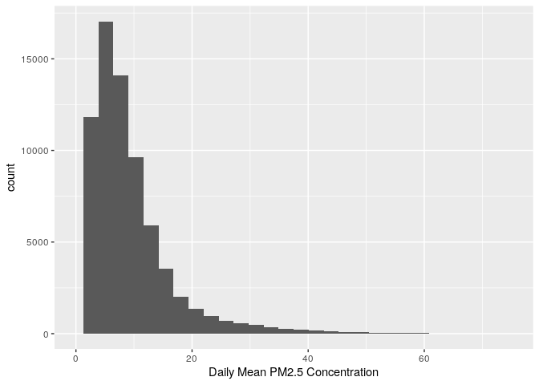
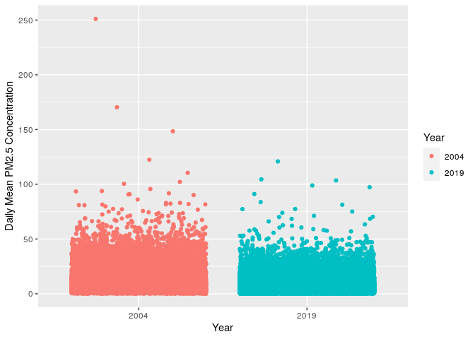
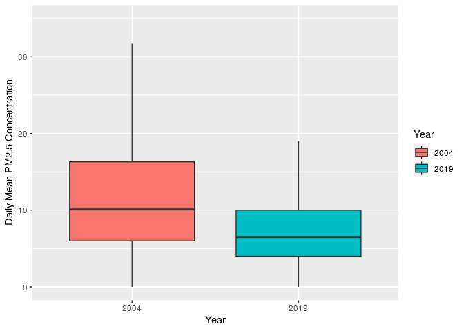
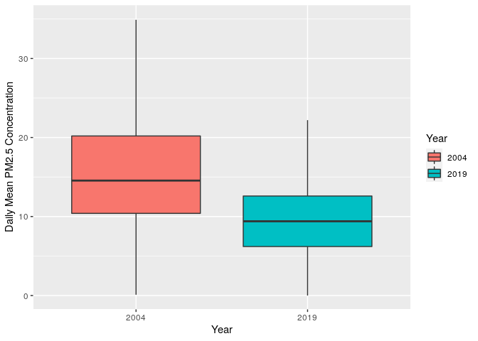
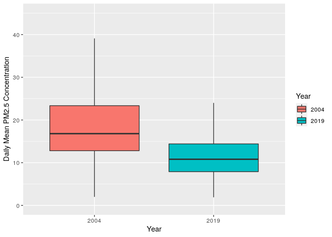

Assignment 1
================

Objective: Determine whether daily concentrations of PM2.5 have
decreased in CA over the last 15 years (2004-2019)

1.  Read in the data using data.table(). For each of the two data sets,
    check the dimensions, headers, footers, variable names and variable
    types. Check for any data issues, particularly in the key variable
    we are analyzing. Summarize findings.

<!-- end list -->

``` r
library(data.table)
library(tidyverse)
```

    ## ── Attaching packages ───────────────────────────────────────────────────────────────────────────────────────────────────────────────────────────────────────────────────── tidyverse 1.3.1 ──

    ## ✔ ggplot2 3.3.5     ✔ purrr   0.3.4
    ## ✔ tibble  3.1.5     ✔ dplyr   1.0.7
    ## ✔ tidyr   1.1.3     ✔ stringr 1.4.0
    ## ✔ readr   2.0.2     ✔ forcats 0.5.1

    ## ── Conflicts ──────────────────────────────────────────────────────────────────────────────────────────────────────────────────────────────────────────────────────── tidyverse_conflicts() ──
    ## ✖ dplyr::between()   masks data.table::between()
    ## ✖ dplyr::filter()    masks stats::filter()
    ## ✖ dplyr::first()     masks data.table::first()
    ## ✖ dplyr::lag()       masks stats::lag()
    ## ✖ dplyr::last()      masks data.table::last()
    ## ✖ purrr::transpose() masks data.table::transpose()

``` r
PM_2004 <- data.table::fread("ad_viz_plotval_data_2004.xls")
#check dimensions 
dim(PM_2004)
```

    ## [1] 19233    20

``` r
nrow(PM_2004)
```

    ## [1] 19233

``` r
ncol(PM_2004)
```

    ## [1] 20

``` r
#check top and bottom of data set
head(PM_2004)
```

    ##          Date Source  Site ID POC Daily Mean PM2.5 Concentration    UNITS
    ## 1: 01/01/2004    AQS 60010007   1                            8.9 ug/m3 LC
    ## 2: 01/02/2004    AQS 60010007   1                           12.2 ug/m3 LC
    ## 3: 01/03/2004    AQS 60010007   1                           16.5 ug/m3 LC
    ## 4: 01/04/2004    AQS 60010007   1                           19.5 ug/m3 LC
    ## 5: 01/05/2004    AQS 60010007   1                           11.5 ug/m3 LC
    ## 6: 01/06/2004    AQS 60010007   1                           32.5 ug/m3 LC
    ##    DAILY_AQI_VALUE Site Name DAILY_OBS_COUNT PERCENT_COMPLETE
    ## 1:              37 Livermore               1              100
    ## 2:              51 Livermore               1              100
    ## 3:              60 Livermore               1              100
    ## 4:              67 Livermore               1              100
    ## 5:              48 Livermore               1              100
    ## 6:              94 Livermore               1              100
    ##    AQS_PARAMETER_CODE                     AQS_PARAMETER_DESC CBSA_CODE
    ## 1:              88101               PM2.5 - Local Conditions     41860
    ## 2:              88502 Acceptable PM2.5 AQI & Speciation Mass     41860
    ## 3:              88502 Acceptable PM2.5 AQI & Speciation Mass     41860
    ## 4:              88502 Acceptable PM2.5 AQI & Speciation Mass     41860
    ## 5:              88502 Acceptable PM2.5 AQI & Speciation Mass     41860
    ## 6:              88502 Acceptable PM2.5 AQI & Speciation Mass     41860
    ##                            CBSA_NAME STATE_CODE      STATE COUNTY_CODE  COUNTY
    ## 1: San Francisco-Oakland-Hayward, CA          6 California           1 Alameda
    ## 2: San Francisco-Oakland-Hayward, CA          6 California           1 Alameda
    ## 3: San Francisco-Oakland-Hayward, CA          6 California           1 Alameda
    ## 4: San Francisco-Oakland-Hayward, CA          6 California           1 Alameda
    ## 5: San Francisco-Oakland-Hayward, CA          6 California           1 Alameda
    ## 6: San Francisco-Oakland-Hayward, CA          6 California           1 Alameda
    ##    SITE_LATITUDE SITE_LONGITUDE
    ## 1:      37.68753      -121.7842
    ## 2:      37.68753      -121.7842
    ## 3:      37.68753      -121.7842
    ## 4:      37.68753      -121.7842
    ## 5:      37.68753      -121.7842
    ## 6:      37.68753      -121.7842

``` r
tail(PM_2004)
```

    ##          Date Source  Site ID POC Daily Mean PM2.5 Concentration    UNITS
    ## 1: 12/14/2004    AQS 61131003   1                             11 ug/m3 LC
    ## 2: 12/17/2004    AQS 61131003   1                             16 ug/m3 LC
    ## 3: 12/20/2004    AQS 61131003   1                             17 ug/m3 LC
    ## 4: 12/23/2004    AQS 61131003   1                              9 ug/m3 LC
    ## 5: 12/26/2004    AQS 61131003   1                             24 ug/m3 LC
    ## 6: 12/29/2004    AQS 61131003   1                              9 ug/m3 LC
    ##    DAILY_AQI_VALUE            Site Name DAILY_OBS_COUNT PERCENT_COMPLETE
    ## 1:              46 Woodland-Gibson Road               1              100
    ## 2:              59 Woodland-Gibson Road               1              100
    ## 3:              61 Woodland-Gibson Road               1              100
    ## 4:              38 Woodland-Gibson Road               1              100
    ## 5:              76 Woodland-Gibson Road               1              100
    ## 6:              38 Woodland-Gibson Road               1              100
    ##    AQS_PARAMETER_CODE       AQS_PARAMETER_DESC CBSA_CODE
    ## 1:              88101 PM2.5 - Local Conditions     40900
    ## 2:              88101 PM2.5 - Local Conditions     40900
    ## 3:              88101 PM2.5 - Local Conditions     40900
    ## 4:              88101 PM2.5 - Local Conditions     40900
    ## 5:              88101 PM2.5 - Local Conditions     40900
    ## 6:              88101 PM2.5 - Local Conditions     40900
    ##                                  CBSA_NAME STATE_CODE      STATE COUNTY_CODE
    ## 1: Sacramento--Roseville--Arden-Arcade, CA          6 California         113
    ## 2: Sacramento--Roseville--Arden-Arcade, CA          6 California         113
    ## 3: Sacramento--Roseville--Arden-Arcade, CA          6 California         113
    ## 4: Sacramento--Roseville--Arden-Arcade, CA          6 California         113
    ## 5: Sacramento--Roseville--Arden-Arcade, CA          6 California         113
    ## 6: Sacramento--Roseville--Arden-Arcade, CA          6 California         113
    ##    COUNTY SITE_LATITUDE SITE_LONGITUDE
    ## 1:   Yolo      38.66121      -121.7327
    ## 2:   Yolo      38.66121      -121.7327
    ## 3:   Yolo      38.66121      -121.7327
    ## 4:   Yolo      38.66121      -121.7327
    ## 5:   Yolo      38.66121      -121.7327
    ## 6:   Yolo      38.66121      -121.7327

``` r
#check variables 
str(PM_2004)
```

    ## Classes 'data.table' and 'data.frame':   19233 obs. of  20 variables:
    ##  $ Date                          : chr  "01/01/2004" "01/02/2004" "01/03/2004" "01/04/2004" ...
    ##  $ Source                        : chr  "AQS" "AQS" "AQS" "AQS" ...
    ##  $ Site ID                       : int  60010007 60010007 60010007 60010007 60010007 60010007 60010007 60010007 60010007 60010007 ...
    ##  $ POC                           : int  1 1 1 1 1 1 1 1 1 1 ...
    ##  $ Daily Mean PM2.5 Concentration: num  8.9 12.2 16.5 19.5 11.5 32.5 15.5 29.9 21 16.9 ...
    ##  $ UNITS                         : chr  "ug/m3 LC" "ug/m3 LC" "ug/m3 LC" "ug/m3 LC" ...
    ##  $ DAILY_AQI_VALUE               : int  37 51 60 67 48 94 58 88 70 61 ...
    ##  $ Site Name                     : chr  "Livermore" "Livermore" "Livermore" "Livermore" ...
    ##  $ DAILY_OBS_COUNT               : int  1 1 1 1 1 1 1 1 1 1 ...
    ##  $ PERCENT_COMPLETE              : num  100 100 100 100 100 100 100 100 100 100 ...
    ##  $ AQS_PARAMETER_CODE            : int  88101 88502 88502 88502 88502 88502 88502 88502 88502 88502 ...
    ##  $ AQS_PARAMETER_DESC            : chr  "PM2.5 - Local Conditions" "Acceptable PM2.5 AQI & Speciation Mass" "Acceptable PM2.5 AQI & Speciation Mass" "Acceptable PM2.5 AQI & Speciation Mass" ...
    ##  $ CBSA_CODE                     : int  41860 41860 41860 41860 41860 41860 41860 41860 41860 41860 ...
    ##  $ CBSA_NAME                     : chr  "San Francisco-Oakland-Hayward, CA" "San Francisco-Oakland-Hayward, CA" "San Francisco-Oakland-Hayward, CA" "San Francisco-Oakland-Hayward, CA" ...
    ##  $ STATE_CODE                    : int  6 6 6 6 6 6 6 6 6 6 ...
    ##  $ STATE                         : chr  "California" "California" "California" "California" ...
    ##  $ COUNTY_CODE                   : int  1 1 1 1 1 1 1 1 1 1 ...
    ##  $ COUNTY                        : chr  "Alameda" "Alameda" "Alameda" "Alameda" ...
    ##  $ SITE_LATITUDE                 : num  37.7 37.7 37.7 37.7 37.7 ...
    ##  $ SITE_LONGITUDE                : num  -122 -122 -122 -122 -122 ...
    ##  - attr(*, ".internal.selfref")=<externalptr>

``` r
#check key variable
summary(PM_2004$`Daily Mean PM2.5 Concentration`)
```

    ##    Min. 1st Qu.  Median    Mean 3rd Qu.    Max. 
    ##   -0.10    6.00   10.10   13.13   16.30  251.00

``` r
mean(is.na(PM_2004$`Daily Mean PM2.5 Concentration`))
```

    ## [1] 0

``` r
PM_2019 <- data.table::fread("ad_viz_plotval_data_2019.xls")
#check dimensions 
dim(PM_2019)
```

    ## [1] 53086    20

``` r
nrow(PM_2019)
```

    ## [1] 53086

``` r
ncol(PM_2019)
```

    ## [1] 20

``` r
#check top and bottom of data set
head(PM_2019)
```

    ##          Date Source  Site ID POC Daily Mean PM2.5 Concentration    UNITS
    ## 1: 01/01/2019    AQS 60010007   3                            5.7 ug/m3 LC
    ## 2: 01/02/2019    AQS 60010007   3                           11.9 ug/m3 LC
    ## 3: 01/03/2019    AQS 60010007   3                           20.1 ug/m3 LC
    ## 4: 01/04/2019    AQS 60010007   3                           28.8 ug/m3 LC
    ## 5: 01/05/2019    AQS 60010007   3                           11.2 ug/m3 LC
    ## 6: 01/06/2019    AQS 60010007   3                            2.7 ug/m3 LC
    ##    DAILY_AQI_VALUE Site Name DAILY_OBS_COUNT PERCENT_COMPLETE
    ## 1:              24 Livermore               1              100
    ## 2:              50 Livermore               1              100
    ## 3:              68 Livermore               1              100
    ## 4:              86 Livermore               1              100
    ## 5:              47 Livermore               1              100
    ## 6:              11 Livermore               1              100
    ##    AQS_PARAMETER_CODE       AQS_PARAMETER_DESC CBSA_CODE
    ## 1:              88101 PM2.5 - Local Conditions     41860
    ## 2:              88101 PM2.5 - Local Conditions     41860
    ## 3:              88101 PM2.5 - Local Conditions     41860
    ## 4:              88101 PM2.5 - Local Conditions     41860
    ## 5:              88101 PM2.5 - Local Conditions     41860
    ## 6:              88101 PM2.5 - Local Conditions     41860
    ##                            CBSA_NAME STATE_CODE      STATE COUNTY_CODE  COUNTY
    ## 1: San Francisco-Oakland-Hayward, CA          6 California           1 Alameda
    ## 2: San Francisco-Oakland-Hayward, CA          6 California           1 Alameda
    ## 3: San Francisco-Oakland-Hayward, CA          6 California           1 Alameda
    ## 4: San Francisco-Oakland-Hayward, CA          6 California           1 Alameda
    ## 5: San Francisco-Oakland-Hayward, CA          6 California           1 Alameda
    ## 6: San Francisco-Oakland-Hayward, CA          6 California           1 Alameda
    ##    SITE_LATITUDE SITE_LONGITUDE
    ## 1:      37.68753      -121.7842
    ## 2:      37.68753      -121.7842
    ## 3:      37.68753      -121.7842
    ## 4:      37.68753      -121.7842
    ## 5:      37.68753      -121.7842
    ## 6:      37.68753      -121.7842

``` r
tail(PM_2019)
```

    ##          Date Source  Site ID POC Daily Mean PM2.5 Concentration    UNITS
    ## 1: 11/11/2019    AQS 61131003   1                           13.5 ug/m3 LC
    ## 2: 11/17/2019    AQS 61131003   1                           18.1 ug/m3 LC
    ## 3: 11/29/2019    AQS 61131003   1                           12.5 ug/m3 LC
    ## 4: 12/17/2019    AQS 61131003   1                           23.8 ug/m3 LC
    ## 5: 12/23/2019    AQS 61131003   1                            1.0 ug/m3 LC
    ## 6: 12/29/2019    AQS 61131003   1                            9.1 ug/m3 LC
    ##    DAILY_AQI_VALUE            Site Name DAILY_OBS_COUNT PERCENT_COMPLETE
    ## 1:              54 Woodland-Gibson Road               1              100
    ## 2:              64 Woodland-Gibson Road               1              100
    ## 3:              52 Woodland-Gibson Road               1              100
    ## 4:              76 Woodland-Gibson Road               1              100
    ## 5:               4 Woodland-Gibson Road               1              100
    ## 6:              38 Woodland-Gibson Road               1              100
    ##    AQS_PARAMETER_CODE       AQS_PARAMETER_DESC CBSA_CODE
    ## 1:              88101 PM2.5 - Local Conditions     40900
    ## 2:              88101 PM2.5 - Local Conditions     40900
    ## 3:              88101 PM2.5 - Local Conditions     40900
    ## 4:              88101 PM2.5 - Local Conditions     40900
    ## 5:              88101 PM2.5 - Local Conditions     40900
    ## 6:              88101 PM2.5 - Local Conditions     40900
    ##                                  CBSA_NAME STATE_CODE      STATE COUNTY_CODE
    ## 1: Sacramento--Roseville--Arden-Arcade, CA          6 California         113
    ## 2: Sacramento--Roseville--Arden-Arcade, CA          6 California         113
    ## 3: Sacramento--Roseville--Arden-Arcade, CA          6 California         113
    ## 4: Sacramento--Roseville--Arden-Arcade, CA          6 California         113
    ## 5: Sacramento--Roseville--Arden-Arcade, CA          6 California         113
    ## 6: Sacramento--Roseville--Arden-Arcade, CA          6 California         113
    ##    COUNTY SITE_LATITUDE SITE_LONGITUDE
    ## 1:   Yolo      38.66121      -121.7327
    ## 2:   Yolo      38.66121      -121.7327
    ## 3:   Yolo      38.66121      -121.7327
    ## 4:   Yolo      38.66121      -121.7327
    ## 5:   Yolo      38.66121      -121.7327
    ## 6:   Yolo      38.66121      -121.7327

``` r
#check variables 
str(PM_2019)
```

    ## Classes 'data.table' and 'data.frame':   53086 obs. of  20 variables:
    ##  $ Date                          : chr  "01/01/2019" "01/02/2019" "01/03/2019" "01/04/2019" ...
    ##  $ Source                        : chr  "AQS" "AQS" "AQS" "AQS" ...
    ##  $ Site ID                       : int  60010007 60010007 60010007 60010007 60010007 60010007 60010007 60010007 60010007 60010007 ...
    ##  $ POC                           : int  3 3 3 3 3 3 3 3 3 3 ...
    ##  $ Daily Mean PM2.5 Concentration: num  5.7 11.9 20.1 28.8 11.2 2.7 2.8 7 3.1 7.1 ...
    ##  $ UNITS                         : chr  "ug/m3 LC" "ug/m3 LC" "ug/m3 LC" "ug/m3 LC" ...
    ##  $ DAILY_AQI_VALUE               : int  24 50 68 86 47 11 12 29 13 30 ...
    ##  $ Site Name                     : chr  "Livermore" "Livermore" "Livermore" "Livermore" ...
    ##  $ DAILY_OBS_COUNT               : int  1 1 1 1 1 1 1 1 1 1 ...
    ##  $ PERCENT_COMPLETE              : num  100 100 100 100 100 100 100 100 100 100 ...
    ##  $ AQS_PARAMETER_CODE            : int  88101 88101 88101 88101 88101 88101 88101 88101 88101 88101 ...
    ##  $ AQS_PARAMETER_DESC            : chr  "PM2.5 - Local Conditions" "PM2.5 - Local Conditions" "PM2.5 - Local Conditions" "PM2.5 - Local Conditions" ...
    ##  $ CBSA_CODE                     : int  41860 41860 41860 41860 41860 41860 41860 41860 41860 41860 ...
    ##  $ CBSA_NAME                     : chr  "San Francisco-Oakland-Hayward, CA" "San Francisco-Oakland-Hayward, CA" "San Francisco-Oakland-Hayward, CA" "San Francisco-Oakland-Hayward, CA" ...
    ##  $ STATE_CODE                    : int  6 6 6 6 6 6 6 6 6 6 ...
    ##  $ STATE                         : chr  "California" "California" "California" "California" ...
    ##  $ COUNTY_CODE                   : int  1 1 1 1 1 1 1 1 1 1 ...
    ##  $ COUNTY                        : chr  "Alameda" "Alameda" "Alameda" "Alameda" ...
    ##  $ SITE_LATITUDE                 : num  37.7 37.7 37.7 37.7 37.7 ...
    ##  $ SITE_LONGITUDE                : num  -122 -122 -122 -122 -122 ...
    ##  - attr(*, ".internal.selfref")=<externalptr>

``` r
#check key variable
summary(PM_2019$`Daily Mean PM2.5 Concentration`)
```

    ##    Min. 1st Qu.  Median    Mean 3rd Qu.    Max. 
    ##  -2.200   4.000   6.500   7.734   9.900 120.900

``` r
mean(is.na(PM_2019$`Daily Mean PM2.5 Concentration`))
```

    ## [1] 0

These are two tables: the 2004 table contain 19,233 rows and 20 columns
representing date, site ID, daily mean PM 2.5 concentration, site name,
etc.The 2019 table also contains 20 columns, but has more rows of data
(53,086). Both tables do not contain NA’s.

2.  Combine the two years of data into one data frame. Use the Date
    variable to create a new column for year, which will serve as an
    identifier. Change the names of the key variables so that they are
    easier to refer in your code.

<!-- end list -->

``` r
#combine data 
PM_combined <- merge(x = PM_2004, y = PM_2019, all = TRUE)
head(PM_combined)
```

    ##          Date Source  Site ID POC Daily Mean PM2.5 Concentration    UNITS
    ## 1: 01/01/2004    AQS 60010007   1                            8.9 ug/m3 LC
    ## 2: 01/01/2004    AQS 60011001   1                           11.1 ug/m3 LC
    ## 3: 01/01/2004    AQS 60074001   3                            4.2 ug/m3 LC
    ## 4: 01/01/2004    AQS 60111002   1                            6.0 ug/m3 LC
    ## 5: 01/01/2004    AQS 60130002   1                            9.8 ug/m3 LC
    ## 6: 01/01/2004    AQS 60179000   1                            0.2 ug/m3 LC
    ##    DAILY_AQI_VALUE                 Site Name DAILY_OBS_COUNT PERCENT_COMPLETE
    ## 1:              37                 Livermore               1              100
    ## 2:              46      Fremont - Chapel Way               1              100
    ## 3:              18 TRAFFIC, RURAL PAVED ROAD               1              100
    ## 4:              25       Colusa-Sunrise Blvd               1              100
    ## 5:              41                   Concord               1              100
    ## 6:               1                  Bliss SP               1              100
    ##    AQS_PARAMETER_CODE                     AQS_PARAMETER_DESC CBSA_CODE
    ## 1:              88101               PM2.5 - Local Conditions     41860
    ## 2:              88101               PM2.5 - Local Conditions     41860
    ## 3:              88502 Acceptable PM2.5 AQI & Speciation Mass     17020
    ## 4:              88101               PM2.5 - Local Conditions        NA
    ## 5:              88101               PM2.5 - Local Conditions     41860
    ## 6:              88502 Acceptable PM2.5 AQI & Speciation Mass     40900
    ##                                  CBSA_NAME STATE_CODE      STATE COUNTY_CODE
    ## 1:       San Francisco-Oakland-Hayward, CA          6 California           1
    ## 2:       San Francisco-Oakland-Hayward, CA          6 California           1
    ## 3:                               Chico, CA          6 California           7
    ## 4:                                                  6 California          11
    ## 5:       San Francisco-Oakland-Hayward, CA          6 California          13
    ## 6: Sacramento--Roseville--Arden-Arcade, CA          6 California          17
    ##          COUNTY SITE_LATITUDE SITE_LONGITUDE
    ## 1:      Alameda      37.68753      -121.7842
    ## 2:      Alameda      37.53583      -121.9618
    ## 3:        Butte      39.32756      -121.6688
    ## 4:       Colusa      39.18919      -121.9989
    ## 5: Contra Costa      37.93601      -122.0262
    ## 6:    El Dorado      38.97600      -120.1035

``` r
#check number of rows
PM_2004 %>% nrow()
```

    ## [1] 19233

``` r
PM_2019 %>% nrow()
```

    ## [1] 53086

``` r
PM_combined %>% nrow()
```

    ## [1] 72319

``` r
#create new column for year
PM_combined[, Year := format(as.Date(Date, format = "%m/%d/%Y"), "%Y")]
head(PM_combined)
```

    ##          Date Source  Site ID POC Daily Mean PM2.5 Concentration    UNITS
    ## 1: 01/01/2004    AQS 60010007   1                            8.9 ug/m3 LC
    ## 2: 01/01/2004    AQS 60011001   1                           11.1 ug/m3 LC
    ## 3: 01/01/2004    AQS 60074001   3                            4.2 ug/m3 LC
    ## 4: 01/01/2004    AQS 60111002   1                            6.0 ug/m3 LC
    ## 5: 01/01/2004    AQS 60130002   1                            9.8 ug/m3 LC
    ## 6: 01/01/2004    AQS 60179000   1                            0.2 ug/m3 LC
    ##    DAILY_AQI_VALUE                 Site Name DAILY_OBS_COUNT PERCENT_COMPLETE
    ## 1:              37                 Livermore               1              100
    ## 2:              46      Fremont - Chapel Way               1              100
    ## 3:              18 TRAFFIC, RURAL PAVED ROAD               1              100
    ## 4:              25       Colusa-Sunrise Blvd               1              100
    ## 5:              41                   Concord               1              100
    ## 6:               1                  Bliss SP               1              100
    ##    AQS_PARAMETER_CODE                     AQS_PARAMETER_DESC CBSA_CODE
    ## 1:              88101               PM2.5 - Local Conditions     41860
    ## 2:              88101               PM2.5 - Local Conditions     41860
    ## 3:              88502 Acceptable PM2.5 AQI & Speciation Mass     17020
    ## 4:              88101               PM2.5 - Local Conditions        NA
    ## 5:              88101               PM2.5 - Local Conditions     41860
    ## 6:              88502 Acceptable PM2.5 AQI & Speciation Mass     40900
    ##                                  CBSA_NAME STATE_CODE      STATE COUNTY_CODE
    ## 1:       San Francisco-Oakland-Hayward, CA          6 California           1
    ## 2:       San Francisco-Oakland-Hayward, CA          6 California           1
    ## 3:                               Chico, CA          6 California           7
    ## 4:                                                  6 California          11
    ## 5:       San Francisco-Oakland-Hayward, CA          6 California          13
    ## 6: Sacramento--Roseville--Arden-Arcade, CA          6 California          17
    ##          COUNTY SITE_LATITUDE SITE_LONGITUDE Year
    ## 1:      Alameda      37.68753      -121.7842 2004
    ## 2:      Alameda      37.53583      -121.9618 2004
    ## 3:        Butte      39.32756      -121.6688 2004
    ## 4:       Colusa      39.18919      -121.9989 2004
    ## 5: Contra Costa      37.93601      -122.0262 2004
    ## 6:    El Dorado      38.97600      -120.1035 2004

3.  Create a basic map in leaflet that shows the locations of the sites
    (make sure to use different colors for each year). Summarize spatial
    distribution of monitoring sites.

<!-- end list -->

``` r
library(leaflet)
leaflet() %>%
  addProviderTiles('CartoDB.Positron') %>%
  addCircles(
  data = PM_2019,
  lat=~SITE_LATITUDE, lng=~SITE_LONGITUDE,
  opacity = 1, fillOpacity = 1, radius = 10, color = "blue") %>%
  addCircles(
  data = PM_2004,
  lat=~SITE_LATITUDE, lng=~SITE_LONGITUDE,
  opacity = 1, fillOpacity = 1, radius = 10, color = "red"
)
```

The sites seem to distributed throughout the state between both years.

4.  Check for any missing or implausible values of PM25 in the combined
    dataset. Explore the proportions of each and provide a summary of
    any temporal patterns you see in these observations.

<!-- end list -->

``` r
#check dimensions 
dim(PM_combined)
```

    ## [1] 72319    21

``` r
nrow(PM_combined)
```

    ## [1] 72319

``` r
ncol(PM_combined)
```

    ## [1] 21

``` r
#check top and bottom of data set
head(PM_combined)
```

    ##          Date Source  Site ID POC Daily Mean PM2.5 Concentration    UNITS
    ## 1: 01/01/2004    AQS 60010007   1                            8.9 ug/m3 LC
    ## 2: 01/01/2004    AQS 60011001   1                           11.1 ug/m3 LC
    ## 3: 01/01/2004    AQS 60074001   3                            4.2 ug/m3 LC
    ## 4: 01/01/2004    AQS 60111002   1                            6.0 ug/m3 LC
    ## 5: 01/01/2004    AQS 60130002   1                            9.8 ug/m3 LC
    ## 6: 01/01/2004    AQS 60179000   1                            0.2 ug/m3 LC
    ##    DAILY_AQI_VALUE                 Site Name DAILY_OBS_COUNT PERCENT_COMPLETE
    ## 1:              37                 Livermore               1              100
    ## 2:              46      Fremont - Chapel Way               1              100
    ## 3:              18 TRAFFIC, RURAL PAVED ROAD               1              100
    ## 4:              25       Colusa-Sunrise Blvd               1              100
    ## 5:              41                   Concord               1              100
    ## 6:               1                  Bliss SP               1              100
    ##    AQS_PARAMETER_CODE                     AQS_PARAMETER_DESC CBSA_CODE
    ## 1:              88101               PM2.5 - Local Conditions     41860
    ## 2:              88101               PM2.5 - Local Conditions     41860
    ## 3:              88502 Acceptable PM2.5 AQI & Speciation Mass     17020
    ## 4:              88101               PM2.5 - Local Conditions        NA
    ## 5:              88101               PM2.5 - Local Conditions     41860
    ## 6:              88502 Acceptable PM2.5 AQI & Speciation Mass     40900
    ##                                  CBSA_NAME STATE_CODE      STATE COUNTY_CODE
    ## 1:       San Francisco-Oakland-Hayward, CA          6 California           1
    ## 2:       San Francisco-Oakland-Hayward, CA          6 California           1
    ## 3:                               Chico, CA          6 California           7
    ## 4:                                                  6 California          11
    ## 5:       San Francisco-Oakland-Hayward, CA          6 California          13
    ## 6: Sacramento--Roseville--Arden-Arcade, CA          6 California          17
    ##          COUNTY SITE_LATITUDE SITE_LONGITUDE Year
    ## 1:      Alameda      37.68753      -121.7842 2004
    ## 2:      Alameda      37.53583      -121.9618 2004
    ## 3:        Butte      39.32756      -121.6688 2004
    ## 4:       Colusa      39.18919      -121.9989 2004
    ## 5: Contra Costa      37.93601      -122.0262 2004
    ## 6:    El Dorado      38.97600      -120.1035 2004

``` r
tail(PM_combined)
```

    ##          Date Source  Site ID POC Daily Mean PM2.5 Concentration    UNITS
    ## 1: 12/31/2019    AQS 61110009   3                            0.0 ug/m3 LC
    ## 2: 12/31/2019    AQS 61111004   3                            3.5 ug/m3 LC
    ## 3: 12/31/2019    AQS 61112002   3                            1.2 ug/m3 LC
    ## 4: 12/31/2019    AQS 61112002   4                            1.9 ug/m3 LC
    ## 5: 12/31/2019    AQS 61113001   3                            1.2 ug/m3 LC
    ## 6: 12/31/2019    AQS 61130004   3                           12.4 ug/m3 LC
    ##    DAILY_AQI_VALUE                  Site Name DAILY_OBS_COUNT PERCENT_COMPLETE
    ## 1:               0             Piru - Pacific               1              100
    ## 2:              15       Ojai - East Ojai Ave               1              100
    ## 3:               5 Simi Valley-Cochran Street               1              100
    ## 4:               8 Simi Valley-Cochran Street               1              100
    ## 5:               5  El Rio-Rio Mesa School #2               1              100
    ## 6:              52           Davis-UCD Campus               1              100
    ##    AQS_PARAMETER_CODE                     AQS_PARAMETER_DESC CBSA_CODE
    ## 1:              88101               PM2.5 - Local Conditions     37100
    ## 2:              88101               PM2.5 - Local Conditions     37100
    ## 3:              88101               PM2.5 - Local Conditions     37100
    ## 4:              88101               PM2.5 - Local Conditions     37100
    ## 5:              88101               PM2.5 - Local Conditions     37100
    ## 6:              88502 Acceptable PM2.5 AQI & Speciation Mass     40900
    ##                                  CBSA_NAME STATE_CODE      STATE COUNTY_CODE
    ## 1:        Oxnard-Thousand Oaks-Ventura, CA          6 California         111
    ## 2:        Oxnard-Thousand Oaks-Ventura, CA          6 California         111
    ## 3:        Oxnard-Thousand Oaks-Ventura, CA          6 California         111
    ## 4:        Oxnard-Thousand Oaks-Ventura, CA          6 California         111
    ## 5:        Oxnard-Thousand Oaks-Ventura, CA          6 California         111
    ## 6: Sacramento--Roseville--Arden-Arcade, CA          6 California         113
    ##     COUNTY SITE_LATITUDE SITE_LONGITUDE Year
    ## 1: Ventura      34.40428      -118.8100 2019
    ## 2: Ventura      34.44806      -119.2313 2019
    ## 3: Ventura      34.27632      -118.6837 2019
    ## 4: Ventura      34.27632      -118.6837 2019
    ## 5: Ventura      34.25239      -119.1432 2019
    ## 6:    Yolo      38.53445      -121.7734 2019

``` r
#check variables 
str(PM_combined)
```

    ## Classes 'data.table' and 'data.frame':   72319 obs. of  21 variables:
    ##  $ Date                          : chr  "01/01/2004" "01/01/2004" "01/01/2004" "01/01/2004" ...
    ##  $ Source                        : chr  "AQS" "AQS" "AQS" "AQS" ...
    ##  $ Site ID                       : int  60010007 60011001 60074001 60111002 60130002 60179000 60190008 60190008 60195001 60195025 ...
    ##  $ POC                           : int  1 1 3 1 1 1 1 5 1 1 ...
    ##  $ Daily Mean PM2.5 Concentration: num  8.9 11.1 4.2 6 9.8 0.2 12 13.8 11.6 15.2 ...
    ##  $ UNITS                         : chr  "ug/m3 LC" "ug/m3 LC" "ug/m3 LC" "ug/m3 LC" ...
    ##  $ DAILY_AQI_VALUE               : int  37 46 18 25 41 1 50 55 48 58 ...
    ##  $ Site Name                     : chr  "Livermore" "Fremont - Chapel Way" "TRAFFIC, RURAL PAVED ROAD" "Colusa-Sunrise Blvd" ...
    ##  $ DAILY_OBS_COUNT               : int  1 1 1 1 1 1 1 1 1 1 ...
    ##  $ PERCENT_COMPLETE              : num  100 100 100 100 100 100 100 100 100 100 ...
    ##  $ AQS_PARAMETER_CODE            : int  88101 88101 88502 88101 88101 88502 88101 88502 88101 88101 ...
    ##  $ AQS_PARAMETER_DESC            : chr  "PM2.5 - Local Conditions" "PM2.5 - Local Conditions" "Acceptable PM2.5 AQI & Speciation Mass" "PM2.5 - Local Conditions" ...
    ##  $ CBSA_CODE                     : int  41860 41860 17020 NA 41860 40900 23420 23420 23420 23420 ...
    ##  $ CBSA_NAME                     : chr  "San Francisco-Oakland-Hayward, CA" "San Francisco-Oakland-Hayward, CA" "Chico, CA" "" ...
    ##  $ STATE_CODE                    : int  6 6 6 6 6 6 6 6 6 6 ...
    ##  $ STATE                         : chr  "California" "California" "California" "California" ...
    ##  $ COUNTY_CODE                   : int  1 1 7 11 13 17 19 19 19 19 ...
    ##  $ COUNTY                        : chr  "Alameda" "Alameda" "Butte" "Colusa" ...
    ##  $ SITE_LATITUDE                 : num  37.7 37.5 39.3 39.2 37.9 ...
    ##  $ SITE_LONGITUDE                : num  -122 -122 -122 -122 -122 ...
    ##  $ Year                          : chr  "2004" "2004" "2004" "2004" ...
    ##  - attr(*, ".internal.selfref")=<externalptr> 
    ##  - attr(*, "sorted")= chr [1:20] "Date" "Source" "Site ID" "POC" ...

``` r
#check key variable
summary(PM_combined$`Daily Mean PM2.5 Concentration`)
```

    ##    Min. 1st Qu.  Median    Mean 3rd Qu.    Max. 
    ##  -2.200   4.400   7.200   9.167  11.300 251.000

``` r
summary(PM_combined$`DAILY_AQI_VALUE`)
```

    ##    Min. 1st Qu.  Median    Mean 3rd Qu.    Max. 
    ##    0.00   18.00   30.00   34.75   47.00  301.00

``` r
summary(PM_combined$`DAILY_OBS_COUNT`)
```

    ##    Min. 1st Qu.  Median    Mean 3rd Qu.    Max. 
    ##       1       1       1       1       1       1

``` r
#check Na's
mean(is.na(PM_combined$`Daily Mean PM2.5 Concentration`))
```

    ## [1] 0

``` r
mean(is.na(PM_combined$`Year`))
```

    ## [1] 0

``` r
mean(is.na(PM_combined$`Date`))
```

    ## [1] 0

``` r
mean(is.na(PM_combined$`Site ID`))
```

    ## [1] 0

``` r
mean(is.na(PM_combined$`POC`))
```

    ## [1] 0

``` r
mean(is.na(PM_combined$`DAILY_AQI_VALUE`))
```

    ## [1] 0

``` r
mean(is.na(PM_combined$`Site Name`))
```

    ## [1] 0

``` r
mean(is.na(PM_combined$`DAILY_OBS_COUNT`))
```

    ## [1] 0

``` r
mean(is.na(PM_combined$`AQS_PARAMETER_CODE`))
```

    ## [1] 0

``` r
#Remove implausible values
PM_combined_filtered <- PM_combined[`Daily Mean PM2.5 Concentration` >= 0,]
summary(PM_combined_filtered$`Daily Mean PM2.5 Concentration`)
```

    ##    Min. 1st Qu.  Median    Mean 3rd Qu.    Max. 
    ##   0.000   4.400   7.300   9.207  11.300 251.000

There are no NA’s in the combined data set, but there is a negative
minimum value in the mean PM2.5 concentration which I removed by setting
all the values greater than 0 because there a negative concentration is
implausible.

5.  Explore the main question of interest at three different spatial
    levels. Create exploratory plots (e.g. boxplots, histograms, line
    plots) and summary statistics that best suit each level of data
    (state, county, LA). Be sure to write up explanations of what you
    observe in these data.

<!-- end list -->

``` r
library(ggplot2)

#State 

ggplot(PM_combined_filtered) +
  geom_histogram(mapping = aes(x = `Daily Mean PM2.5 Concentration`)) + xlim(c(0,75))
```

    ## `stat_bin()` using `bins = 30`. Pick better value with `binwidth`.

    ## Warning: Removed 40 rows containing non-finite values (stat_bin).

    ## Warning: Removed 2 rows containing missing values (geom_bar).

<!-- -->

``` r
 ggplot(data = PM_combined_filtered) +
  geom_point(mapping = aes(x = Year, y = `Daily Mean PM2.5 Concentration`, color = Year), position = "jitter")
```

<!-- -->

``` r
box_plot_crop <- ggplot(data= PM_combined_filtered, aes(x= Year, y=`Daily Mean PM2.5 Concentration`, fill=Year))
box_plot_crop + geom_boxplot(outlier.shape = NA) + coord_cartesian(ylim=c(0,35))
```

<!-- -->

``` r
PM_combined_filtered_2004 <- PM_combined_filtered[Year %like% "2004",]
PM_combined_filtered_2019 <- PM_combined_filtered[Year %like% "2019",]
summary(PM_combined_filtered_2004$`Daily Mean PM2.5 Concentration`)
```

    ##    Min. 1st Qu.  Median    Mean 3rd Qu.    Max. 
    ##    0.00    6.00   10.10   13.13   16.30  251.00

``` r
summary(PM_combined_filtered_2019$`Daily Mean PM2.5 Concentration`)
```

    ##    Min. 1st Qu.  Median    Mean 3rd Qu.    Max. 
    ##    0.00    4.00    6.50    7.78   10.00  120.90

``` r
#County 

PM_combined_filtered_county <- PM_combined_filtered[CBSA_NAME %like% "Los Angeles-Long Beach-Anaheim, CA",]
box_plot_crop_county <- ggplot(data= PM_combined_filtered_county, aes(x= Year, y=`Daily Mean PM2.5 Concentration`, fill=Year))
box_plot_crop_county + geom_boxplot(outlier.shape = NA) + coord_cartesian(ylim=c(0,35))
```

<!-- -->

``` r
PM_combined_filtered_county_2004 <- PM_combined_filtered_county[Year %like% "2004",]
PM_combined_filtered_county_2019 <- PM_combined_filtered_county[Year %like% "2019",]
summary(PM_combined_filtered_county_2004$`Daily Mean PM2.5 Concentration`)
```

    ##    Min. 1st Qu.  Median    Mean 3rd Qu.    Max. 
    ##    0.10   10.40   14.55   16.94   20.20   75.60

``` r
summary(PM_combined_filtered_county_2019$`Daily Mean PM2.5 Concentration`)
```

    ##    Min. 1st Qu.  Median    Mean 3rd Qu.    Max. 
    ##   0.000   6.200   9.400   9.987  12.600 120.900

``` r
#Los Angeles

PM_combined_filtered_city <- PM_combined_filtered[`Site Name` %like% "Los Angeles-North Main Street",]
box_plot_crop_city <- ggplot(data= PM_combined_filtered_city, aes(x= Year, y=`Daily Mean PM2.5 Concentration`, fill=Year))
box_plot_crop_city + geom_boxplot(outlier.shape = NA) + coord_cartesian(ylim=c(0,45))
```

<!-- -->

``` r
PM_combined_filtered_city_2004 <- PM_combined_filtered_city[Year %like% "2004",]
PM_combined_filtered_city_2019 <- PM_combined_filtered_city[Year %like% "2019",]
summary(PM_combined_filtered_city_2004$`Daily Mean PM2.5 Concentration`)
```

    ##    Min. 1st Qu.  Median    Mean 3rd Qu.    Max. 
    ##    2.00   12.80   16.80   20.05   23.35   75.00

``` r
summary(PM_combined_filtered_city_2019$`Daily Mean PM2.5 Concentration`)
```

    ##    Min. 1st Qu.  Median    Mean 3rd Qu.    Max. 
    ##    1.90    7.90   10.80   11.61   14.40   43.50

The histogram shows that the instances of daily mean PM 2.5
concentration seems to be 0-15 ug/m3 LC. When separating the data
between the two years, there is more spread of the data in 2004 than in
2019 with the majoriy of the 2019 values being less than 50 ug/m3 LC
whereas the 2004 concentrations range between 0-50 ug/m3 LC. The
Boxplots show clearly that the Daily Mean PM2.5 concentrations have
decreased in 2019 throughout the state (2004 median= 10.10 ug/m3 LC
vs. 2019 avg= 6.5 ug/m3 LC). This decrease was consistent in the county
(2004 median= 14.55 ug/m3 LC vs. 2019 avg= 9.4 ug/m3 LC) and in LA city
(2004 median= 16.80 ug/m3 LC vs. 2019 avg= 10.80 ug/m3 LC).

Conclusion: The daily concentrations of PM2.5 have decreased in CA over
the last 15 years.
